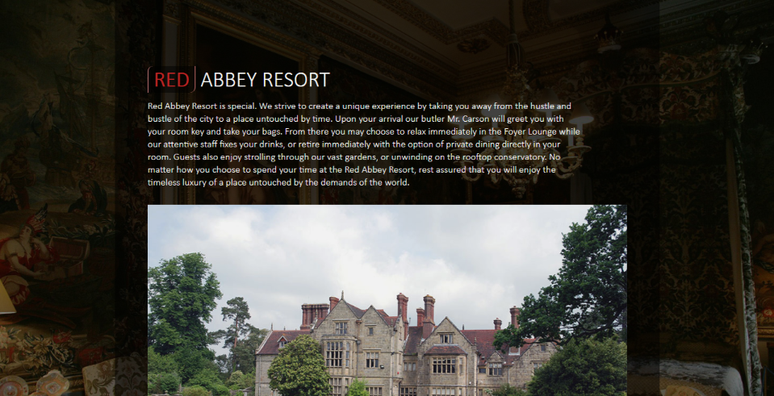

# Google Arica Developer Scholarship 2020
## Introduction to CSS course example modified 
Example worked on in the Introduction to CSS for designers course. Made a few changes to the design and will still make more changes. Also an avenue to practice lessons learnt in the how git works course on real code. View live [Here](https://ifycode.github.io/GADS2020-css-for-designers-intro/). 

